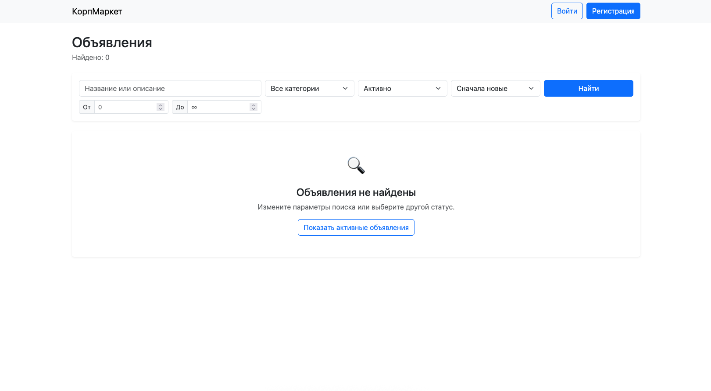
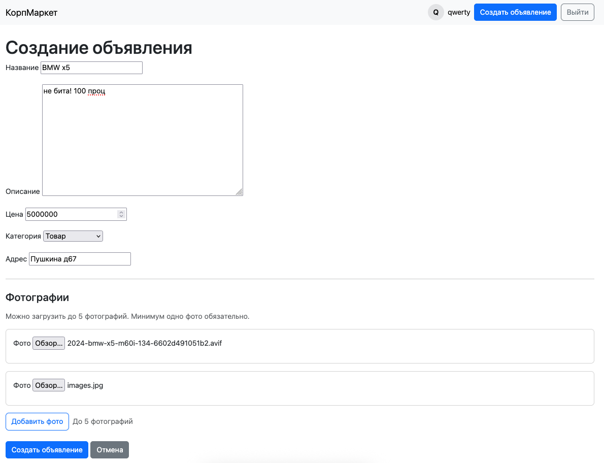
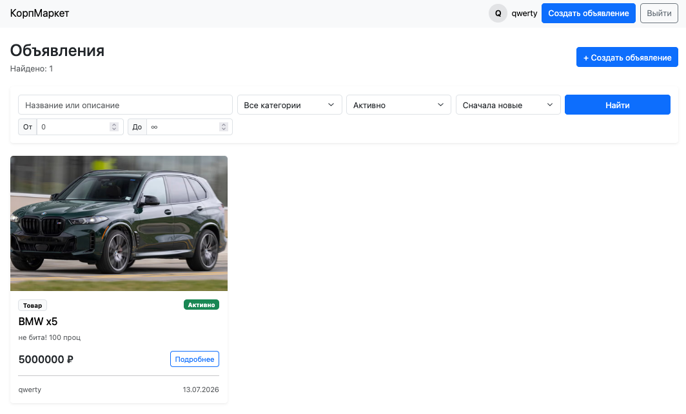
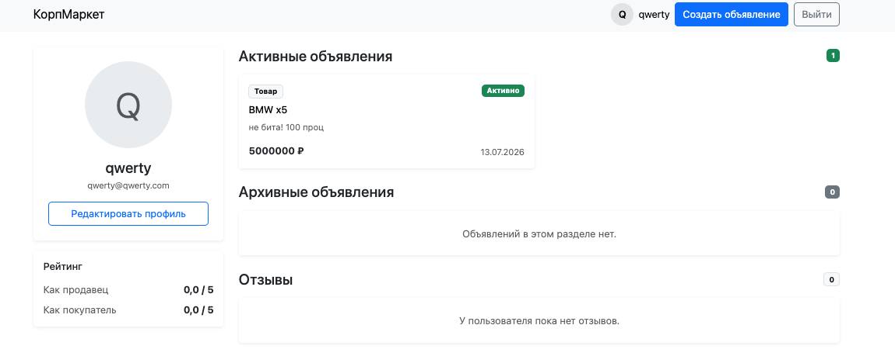
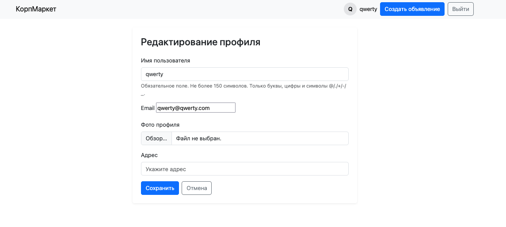
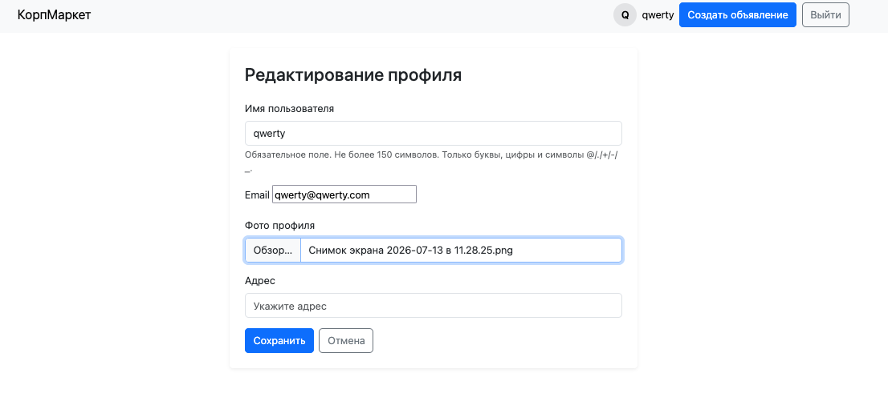
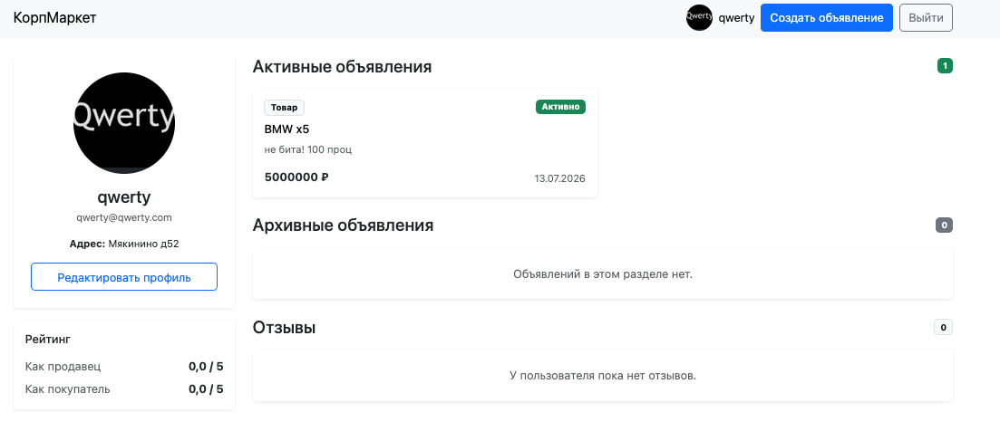
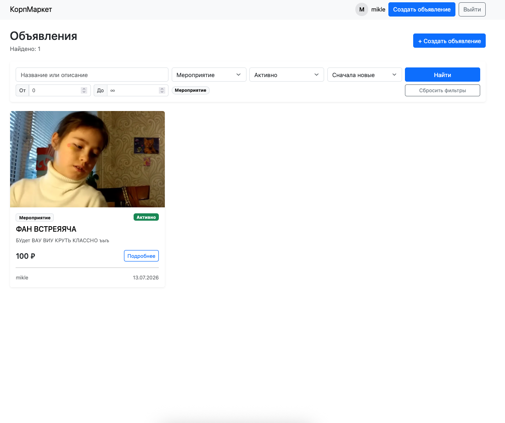
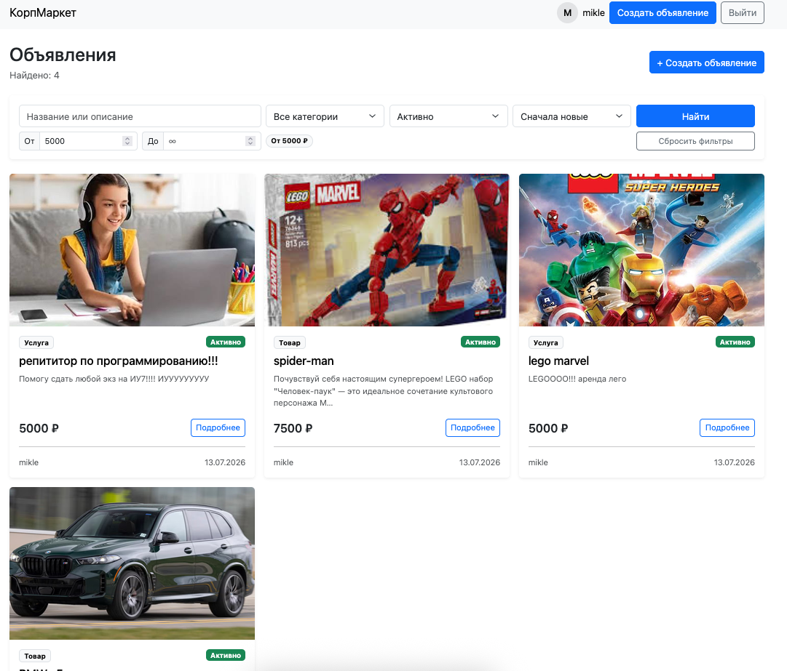
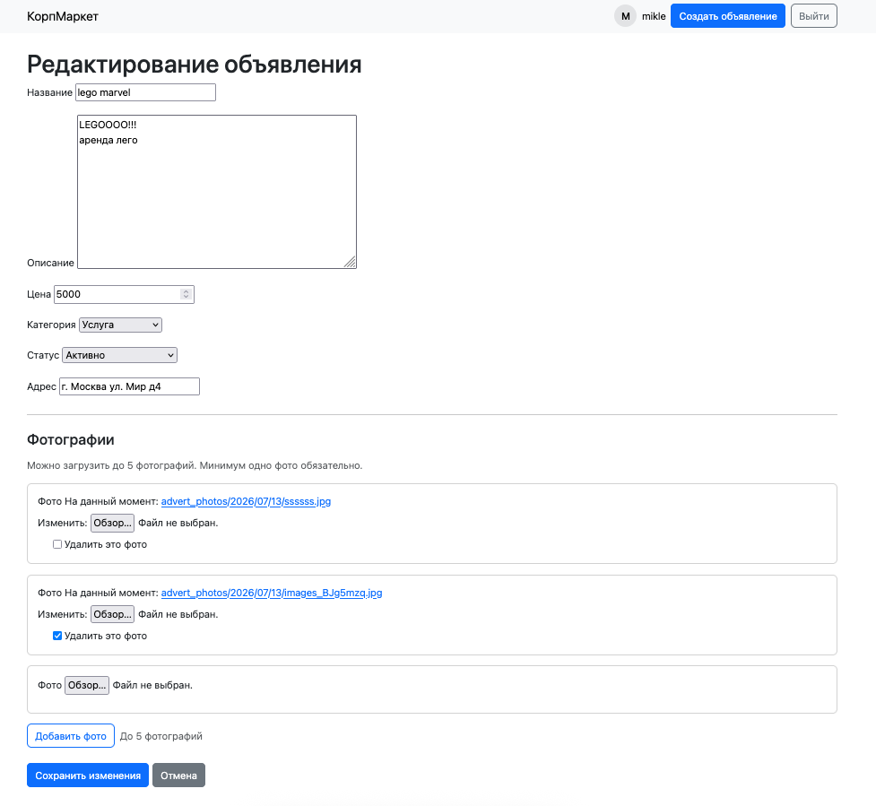

# КорпМаркет

Летняя практика в ivi.

Внутренняя площадка компании для размещения объявлений о продаже товаров, предоставлении услуг и поиске попутчиков между сотрудниками.

---

## Стек технологий

- Python 3.12
- Django 6
- PostgreSQL 18
- Bootstrap

---

## Требования

Перед запуском необходимо установить:

- Python 3.12+
- PostgreSQL 16+

---

# Настройка окружения разработчика

## Клонирование проекта

```bash
git clone https://github.com/Lecry1/corporate-market.git
cd corporate-market
```

---

## Создание виртуального окружения

```bash
python -m venv .venv
```

### Linux/macOS

```bash
source .venv/bin/activate
```

### Windows PowerShell

```powershell
.venv\Scripts\Activate.ps1
```

---

## Установка зависимостей

```bash
pip install -r requirements.txt
pip install -r requirements-dev.txt
```

---

## Установка Git hooks

Для автоматической проверки кода перед коммитом:

```bash
pre-commit install
```

Проверить работу вручную:

```bash
pre-commit run --all-files
```

---

## Настройка переменных окружения

Создать файл `.env` в корне проекта на основе `.env.example`.

Пример `.env`:

```env
SECRET_KEY=your_secret_key
DEBUG=True

DB_NAME=corporate_market
DB_USER=corpmarket_user
DB_PASSWORD=your_password
DB_HOST=localhost
DB_PORT=5432
```

Файл `.env` содержит локальные настройки и не должен попадать в Git.

Для генерации нового `SECRET_KEY`:

```bash
python -c "from django.core.management.utils import get_random_secret_key; print(get_random_secret_key())"
```

# 🐳 Запуск через Docker

Если в проекте настроен Docker, вы можете запустить его изолированно, не настраивая локальный PostgreSQL и Python-окружение:

Соберите образ и поднимите контейнеры в фоновом режиме:
```Bash
docker-compose up -d --build
```
Выполните миграции внутри работающего контейнера:
```Bash
docker-compose exec web python CorpMarket/manage.py migrate
```
Создайте администратора Django:
```Bash
docker-compose exec web python CorpMarket/manage.py createsuperuser
```

## Дополнительные команды

Посмотреть логи (общие для всех контейнеров и отдельные):
```Bash
docker compose logs -f
docker compose logs -f web
docker compose logs -f db
```

Остановить контейнеры:
```Bash
docker compose down -v
```

## После запуска приложение доступно:

```
http://127.0.0.1:8000/
```

# Небольшой flow user

Главная страница(пока пуста, так как нет объявлений)



Создание объявления

Просмотр детальный объявления







Редактирование профиля



старые объявления + добавленные 

фильтр по мероприяютию

Фильтр по цене


Просмотр профиля


Редактирование Объявления
