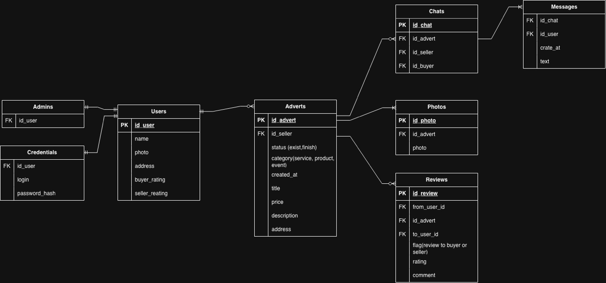
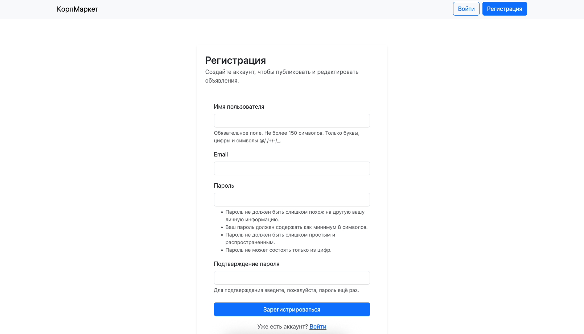
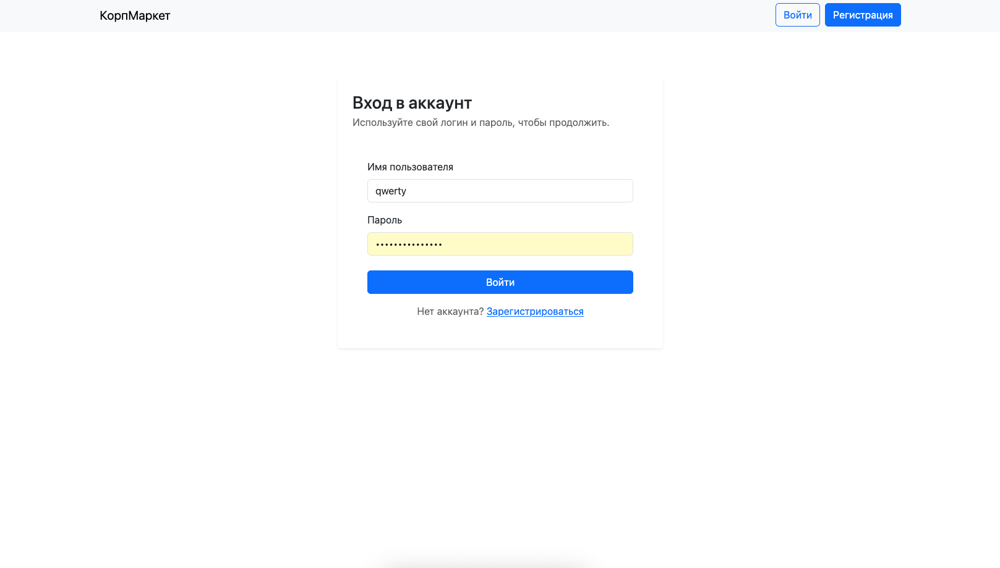
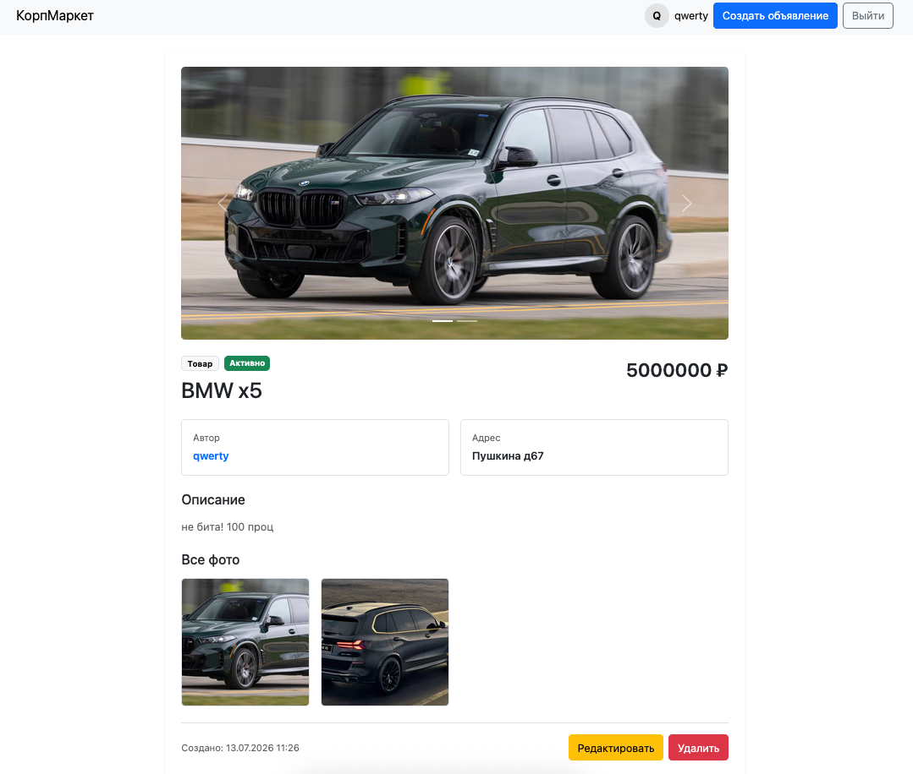
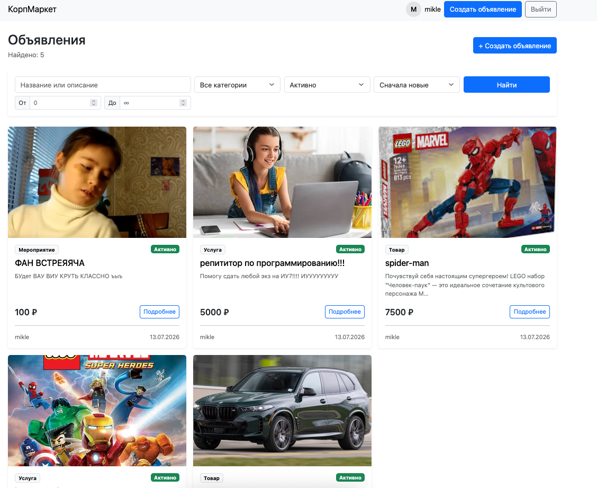
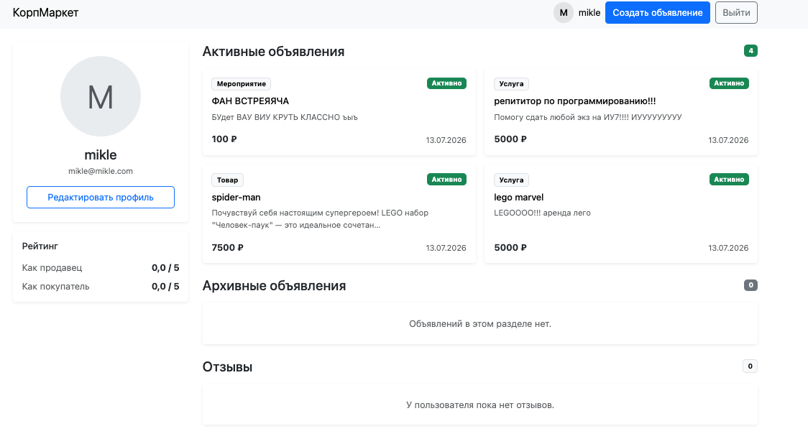
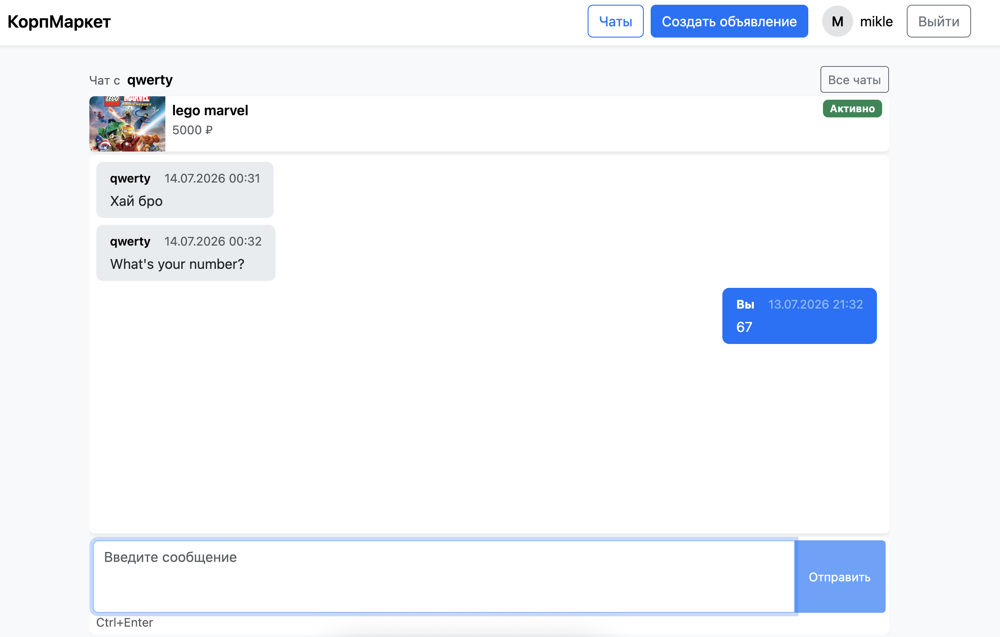
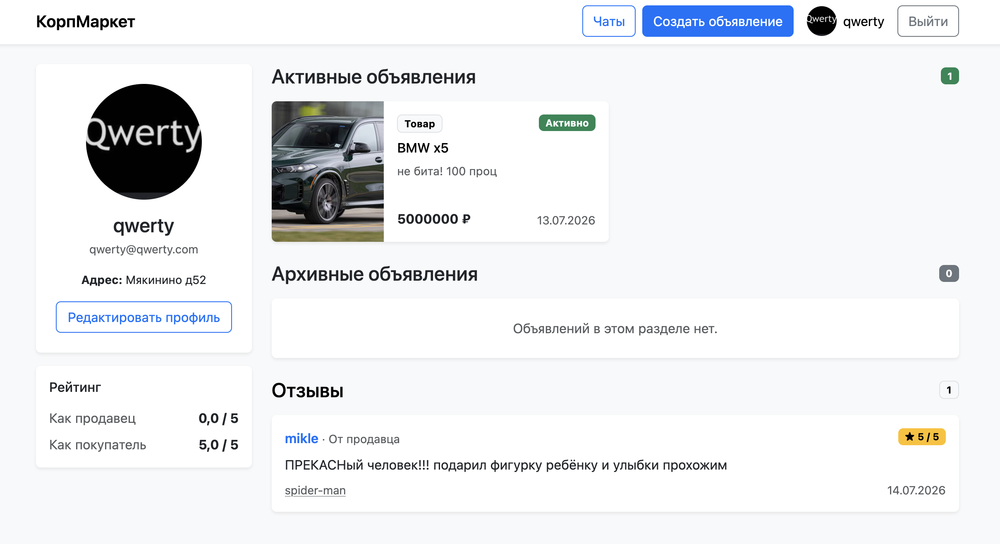

# КорпМаркет

Летняя практика в ivi.

Внутренняя площадка компании для размещения объявлений о продаже товаров, предоставлении услуг и поиске попутчиков между сотрудниками.

---

## Проект выполняли:

- **Глебов Владислав Сергеевич**
- Лямин Егор Алексеевич
- Соколов Сергей Константинович
- Дашкин Рушан Ряшидович
- Гущин Александр Сергеевич

---

## Стек технологий

- Python 3.12
- Django 6
- PostgreSQL 18
- Bootstrap

---

## Требования

Перед запуском необходимо установить:

- Python 3.12+
- PostgreSQL 16+

---

# Настройка окружения разработчика

## Клонирование проекта

```bash
git clone https://github.com/Lecry1/corporate-market.git
cd corporate-market
```

---

## Создание виртуального окружения

```bash
python -m venv .venv
```

### Linux/macOS

```bash
source .venv/bin/activate
```

### Windows PowerShell

```powershell
.venv\Scripts\Activate.ps1
```

---

## Установка зависимостей

```bash
pip install -r requirements.txt
pip install -r requirements-dev.txt
```

---

## Установка Git hooks

Для автоматической проверки кода перед коммитом:

```bash
pre-commit install
```

Проверить работу вручную:

```bash
pre-commit run --all-files
```

---

## Настройка переменных окружения

Создать файл `.env` в корне проекта на основе `.env.example`.

Пример `.env`:

```env
SECRET_KEY=your_secret_key
DEBUG=True

DB_NAME=corporate_market
DB_USER=corpmarket_user
DB_PASSWORD=your_password
DB_HOST=localhost
DB_PORT=5432
```

Файл `.env` содержит локальные настройки и не должен попадать в Git.

Для генерации нового `SECRET_KEY`:

```bash
python -c "from django.core.management.utils import get_random_secret_key; print(get_random_secret_key())"
```

--- 

# 🐳 Запуск через Docker

Если в проекте настроен Docker, вы можете запустить его изолированно, не настраивая локальный PostgreSQL и Python-окружение:

Соберите образ и поднимите контейнеры в фоновом режиме:
```Bash
docker-compose up -d --build
```
Выполните миграции внутри работающего контейнера:
```Bash
docker-compose exec web python CorpMarket/manage.py migrate
```
Создайте администратора Django:
```Bash
docker-compose exec web python CorpMarket/manage.py createsuperuser
```

## Дополнительные команды

Посмотреть логи (общие для всех контейнеров и отдельные):
```Bash
docker compose logs -f
docker compose logs -f web
docker compose logs -f db
```

Остановить контейнеры:
```Bash
docker compose down -v
```

## После запуска приложение доступно:

```
http://127.0.0.1:8000/
```
## Фикстуры
При запущенном контейнере можно сделать dump всех данных БД
```bash
./fixture_backup.sh
```
А также можно восстановить в репе уже есть тестовые данные
```bash
./fixture_restore.sh
```
креды акков:
admin admin@admin.com admin
qwerty qwerty@qwerty.com 123qweasdzxc!
mikle mikle@milke.com 123qweasdzxc!


## Покрытие
```bash
docker compose exec web pip install coverage
docker compose exec web sh -c "cd CorpMarket && coverage run manage.py test && coverage html"
```
Открываем появившейся html по пути `CorpMarket/htmlcov/index.html`

# Модели

- **Users**  
  Хранит данные сотрудников компании. Используется как основная пользовательская сущность.  
  Поля:  
  - `photo` — фото профиля  
  - `address` — адрес  
  - `buyer_rating` — рейтинг как покупателя  
  - `seller_rating` — рейтинг как продавца  

- **Credentials**  
  Хранит данные для входа пользователя в систему.  
  Поля:  
  - `user` — OneToOne → `Users`  
  - `login` — уникальный логин  
  - `password_hash` — хеш пароля  

- **Admin**  
  Хранит информацию о пользователях с правами администратора.  
  Поля:  
  - `user` — OneToOne → `Users`  

- **Adverts**  
  Основная сущность; хранит объявления пользователей о товарах, услугах или поездках.  
  Поля:  
  - `seller` — ForeignKey → `Users`  
  - `status` — статус (активно, выполнено, архивировано)  
  - `category` — категория (товар, услуга, мероприятие)  
  - `created_at` — дата создания  
  - `title` — заголовок  
  - `price` — цена  
  - `description` — описание  
  - `address` — адрес

- **Photos**  
  Хранит фотографии, прикреплённые к объявлению.  
  Поля:  
  - `advert` — ForeignKey → `Adverts`  
  - `photo` — изображение  

- **Chats**  
  Хранит диалоги между автором объявления и заинтересованным пользователем.  
  Поля:  
  - `advert` — ForeignKey → `Adverts`  
  - `seller` — ForeignKey → `Users`  
  - `buyer` — ForeignKey → `Users`  

- **Messages**  
  Хранит сообщения внутри чата.  
  Поля:  
  - `chat` — ForeignKey → `Chats`  
  - `user` — ForeignKey → `Users` (отправитель)  
  - `created_at` — дата отправки  
  - `message` — текст сообщения  

- **Reviews**  
  Хранит отзывы по завершённым сделкам.  
  Поля:  
  - `from_user` — ForeignKey → `Users` (автор отзыва)  
  - `to_user` — ForeignKey → `Users` (получатель отзыва)  
  - `advert` — ForeignKey → `Adverts`  
  - `flag` — кому оставлен отзыв (покупателю или продавцу)  
  - `rating` — оценка (1–5)  
  - `comment` — текст отзыва

## Связи
- **Users → Adverts / Reviews / Chats / Messages**: один ко многим.
- **Adverts → Photos / Reviews / Chats**: один ко многим.
- **Chats → Messages**: один ко многим.
- **Users → Credentials / Admin**: один к одному.

## ER-диаграмма базы данных


---

# Скриншоты

- **Авторизация и Регистрация**




- **Детальный просмотр объявления**


- **Список объявлений** 


- **Просмотр профиля**


- **Чаты**


- **Отзывы** 
